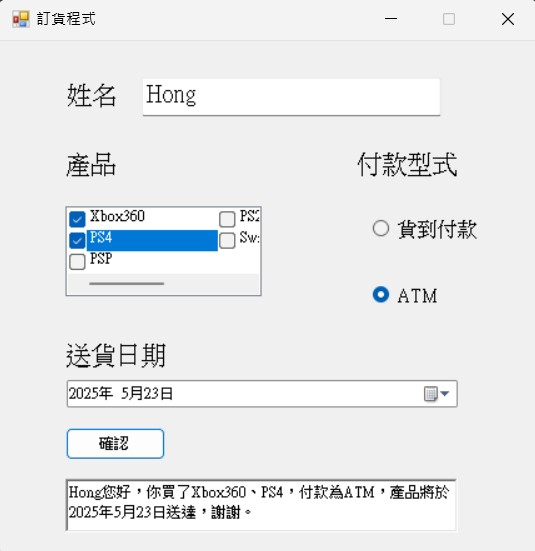
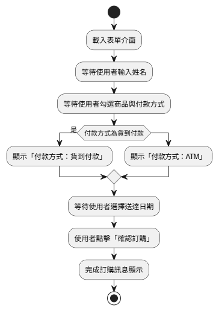

<h1 style="font-size: 28px;">Ordering Interface - C# WinForms 訂貨系統介面</h1>

本專案為課堂 Windows Forms 作業，模擬一個基本的訂貨流程 GUI。使用者可輸入姓名、選取商品與付款方式，系統會產生對應的簡訊樣式確認內容。

此程式重點為 C# 表單控制與表單元素互動，並無資料庫或實際下單功能，僅作為 GUI 設計初學練習。

<h2 style="font-size: 20px;">系統畫面展示</h2>

  

<h2>功能介紹與實作邏輯</h2>
<ul>
  <li>
    <strong>1. 使用者姓名輸入</strong> 
    - 若姓名欄位為空，則「產生確認訊息」按鈕為無效狀態 
    - 有效輸入後按鈕才可使用
  </li>
  <li>
    <strong>2. 商品選擇</strong> 
    - 使用 <code>CheckedListBox</code> 顯示多項商品 
    - 可勾選一項或多項，系統將自動生成「A、B、C」樣式句子
  </li>
  <li>
    <strong>3. 付款方式選擇</strong> 
    - 使用 <code>RadioButton</code> 選擇「貨到付款」或「ATM」 
    - 將決定訊息中付款內容
  </li>
  <li>
    <strong>4. 配送日期選擇</strong> 
    - 使用 <code>DateTimePicker</code> 控制預計送達日期
  </li>
  <li>
    <strong>5. 輸出結果</strong> 
    - 於 <code>RichTextBox</code> 顯示完整購物確認訊息
  </li>
</ul>

<h2>使用技術</h2>
<ul>
  <li>表單元件：TextBox、CheckedListBox、RadioButton、DateTimePicker、RichTextBox、Button</li>
  <li>輸入檢查與控制互動：<code>TextChanged</code>、<code>Click</code> 事件觸發內容產生</li>
</ul>

<h2>系統流程圖</h2>

